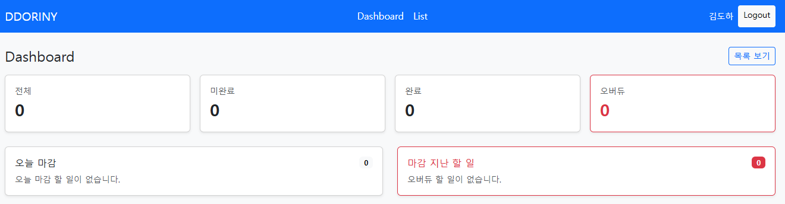
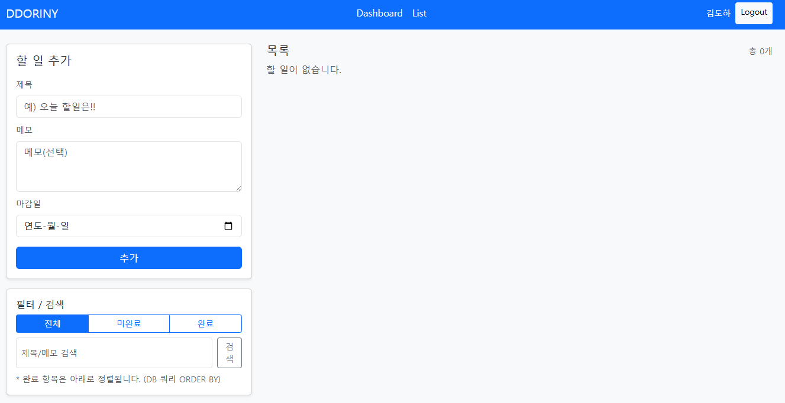
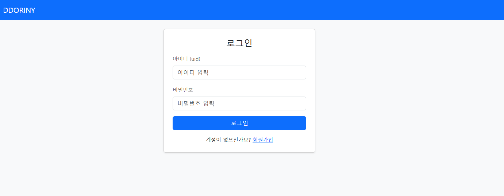
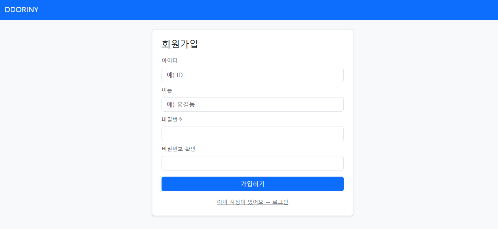

# MiniProject-ToDoList

Flask + MySQL 기반 ToDo List 웹 애플리케이션 미니 프로젝트입니다.
Repository–Service–Route 레이어드 아키텍처와 Blueprint 분리를 적용하여
실무형 백엔드 구조 설계를 연습하는 것을 목표로 구현했습니다.

---

## Project Summary

| 항목           | 내용                                 |
| ------------ | ---------------------------------- |
| Architecture | Repository – Service – Route 계층 분리 |
| Auth         | Session 기반 로그인                     |
| Data         | 사용자별 Todo 분리                       |
| Delete       | Soft Delete 패턴                     |
| DB           | MySQL + 전용 계정 권한                   |
| UI           | Bootstrap 기반 템플릿                   |


---

## Screenshots (Click to expand)

클릭하면 이미지를 볼 수 있습니다.

<details>
<summary>Dashboard</summary>



</details>

<details>
<summary>List</summary>



</details>

<details>
<summary>Login</summary>



</details>

<details>
<summary>Signup</summary>



</details>

---

## Project Goals

* Flask 애플리케이션 구조 이해
* Blueprint 라우팅 분리
* Service / Repository 계층 구조 적용
* MySQL 스키마 설계
* 사용자별 ToDo CRUD
* Dashboard 요약 화면 구현

---

## Tech Stack

Language

* Python 3.x

Backend

* Flask
* Blueprint
* Session Auth

Database

* MySQL
* PyMySQL
* cryptography (sha2 인증 대응)

Frontend

* HTML
* CSS
* Bootstrap 5

---

## Core Features

* 회원가입 / 로그인 / 로그아웃
* 사용자별 Todo 목록
* 할 일 추가 / 수정 / 삭제 (Soft Delete)
* 완료 / 미완료 토글
* 마감일 관리
* 필터 (전체 / 완료 / 미완료)
* 검색 (제목 / 메모)
* Dashboard 요약 카드

  * 전체 개수
  * 완료
  * 미완료
  * 마감 초과(overdue)

---

## Project Structure

```
MiniProject-ToDoList/
├─ app/
│ ├─ __init__.py
│ ├─ config.py
│ ├─ db.py
│
│ ├─ routes/
│ │ ├─ auth_routes.py
│ │ └─ todo_routes.py
│
│ ├─ services/
│ │ ├─ auth_service.py
│ │ └─ todo_service.py
│
│ ├─ repositories/
│ │ ├─ member_repository.py
│ │ └─ todo_repository.py
│
│ ├─ templates/
│ │ ├─ auth/
│ │ └─ todo/
│
│ └─ static/css/
│
├─ sql/
├─ requirements.txt
├─ run.py
└─ README.md
```

---

## Database Design

Database: `todo_list`

### members

| column     | description     |
| ---------- | --------------- |
| id         | PK              |
| uid        | 로그인 ID (UNIQUE) |
| password   | 비밀번호            |
| name       | 사용자 이름          |
| role       | admin / user    |
| active     | 계정 활성 여부        |
| created_at | 생성 시각           |
| updated_at | 수정 시각           |

---

### todos

| column     | description |
| ---------- | ----------- |
| id         | PK          |
| member_id  | 작성자 FK      |
| title      | 제목          |
| memo       | 메모          |
| is_done    | 완료 여부       |
| due_date   | 마감일         |
| active     | soft delete |
| created_at | 생성 시각       |
| updated_at | 수정 시각       |

---

## Run Guide (Local)

### 가상환경

```
python -m venv .venv
.venv\Scripts\activate
```

### 패키지 설치

```
pip install -r requirements.txt
```

### DB 생성

```
sql/DB_mysql.sql 실행
sql/DB_mysql_admin.sql 실행
```

### 환경변수 설정 (.env)

```
DB_HOST=127.0.0.1
DB_PORT=3306
DB_NAME=todo_list
DB_USER=todo_user
DB_PASSWORD=비밀번호
SECRET_KEY=임의값
```

### 서버 실행

```
python run.py
```

접속:
[http://localhost:5000](http://localhost:5000)

---

## Design Decisions

* Blueprint 단위 라우트 분리
* Repository → Service → Route 책임 분리
* DB 전용 계정 사용 (최소 권한)
* Soft Delete 패턴 적용
* created_at / updated_at 자동 관리
* 인증 / 서비스 / 저장소 계층 역할 분리

---

## Future Extensions

* 우선순위 필드
* 태그 시스템
* REST API 제공
* 프론트엔드 분리 (React / Vue)
* 통계 차트 위젯
* 알림 기능

---

## License

학습 및 포트폴리오 용도
